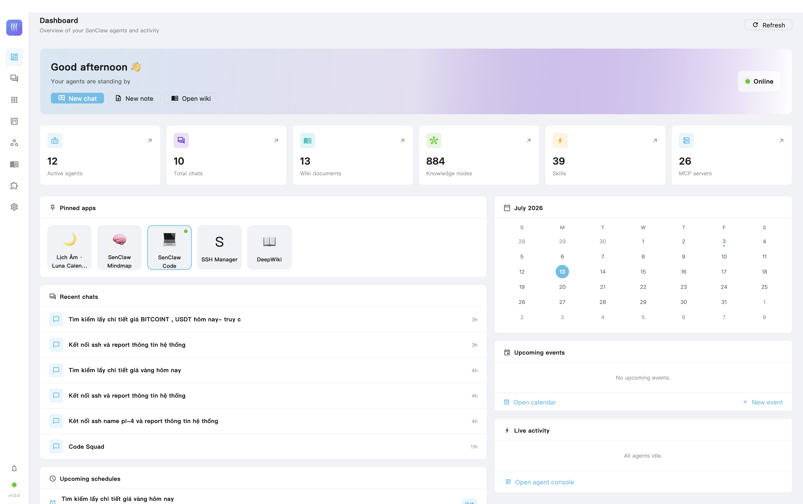
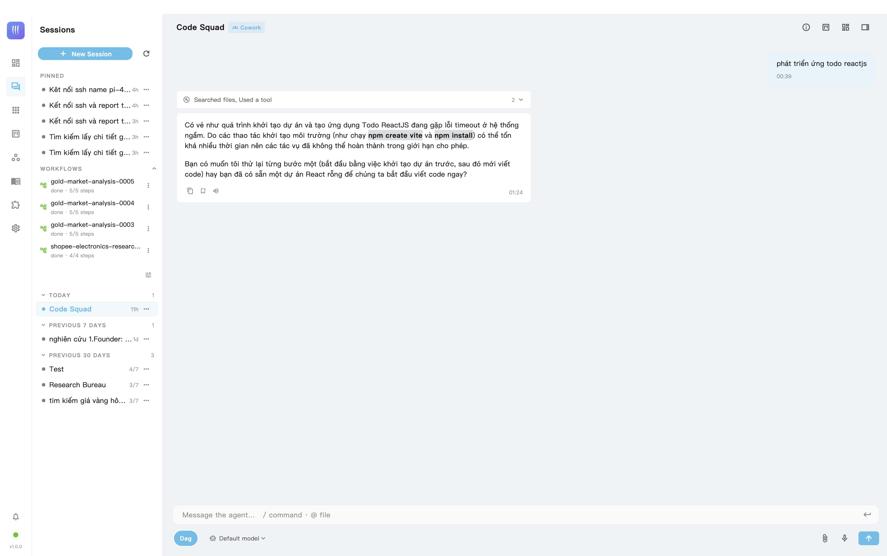
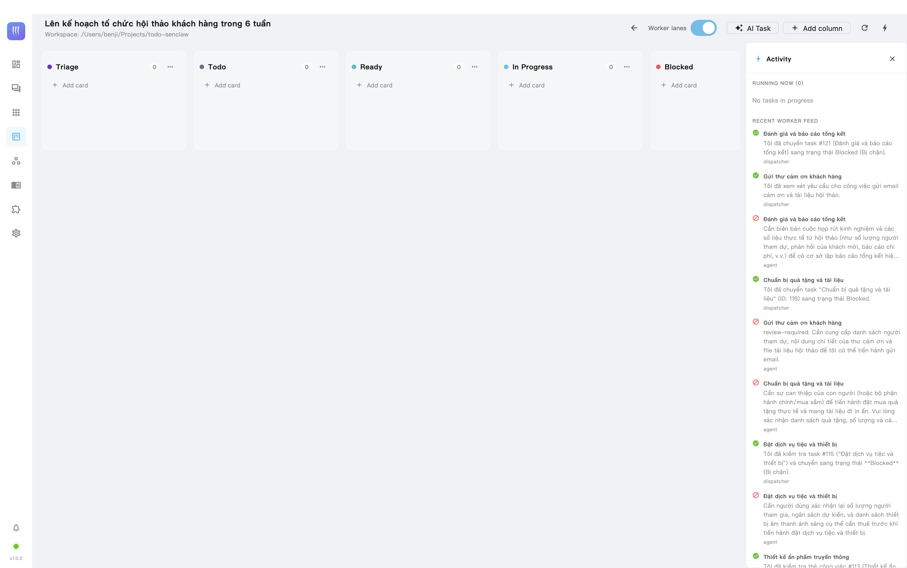
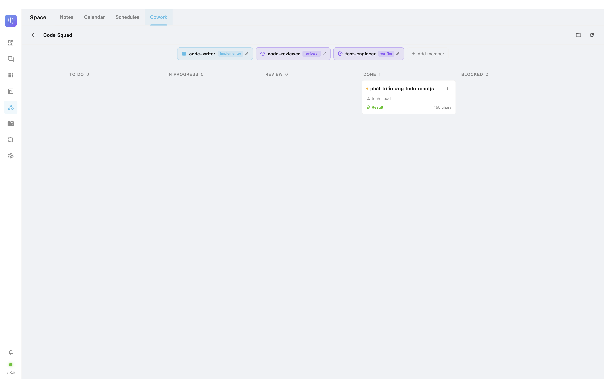
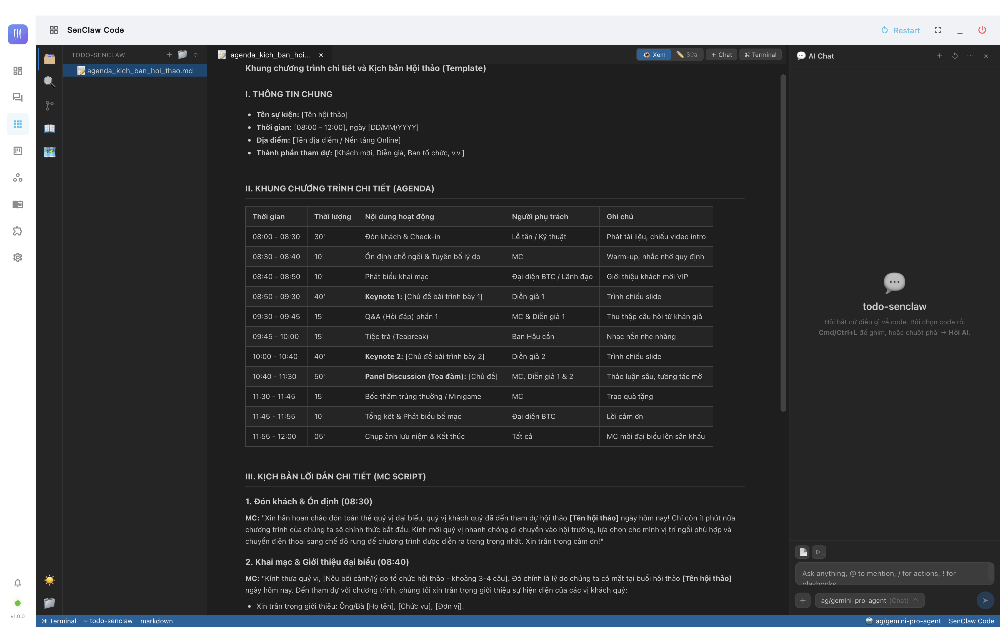
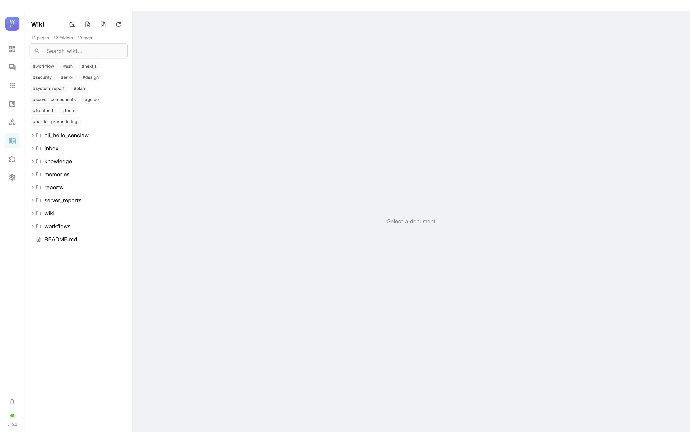
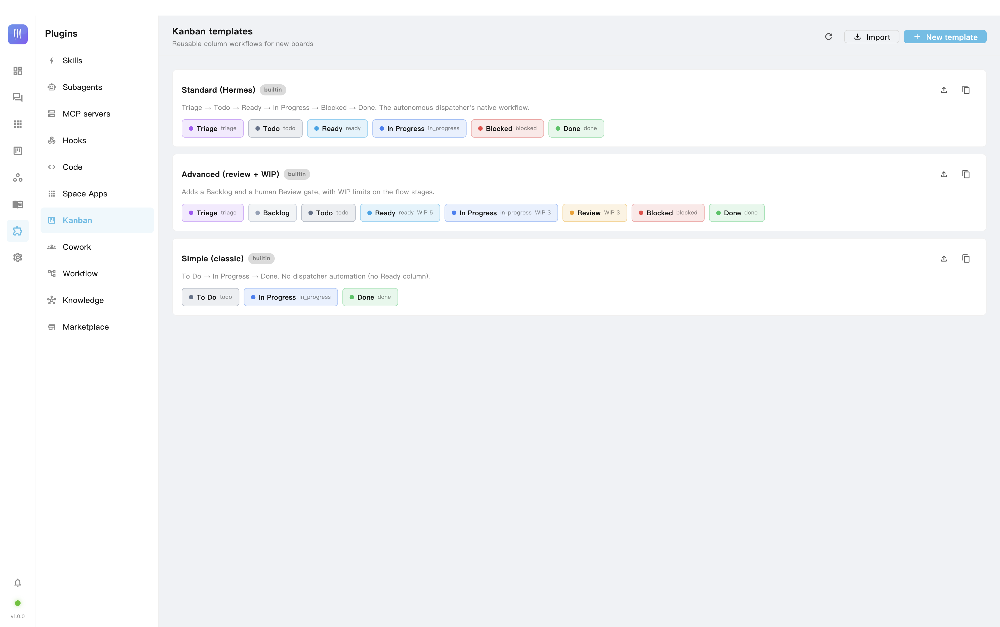

<p align="center">
  
</p>

<h1 align="center">SenClaw</h1>

<p align="center">
  <em>A general-purpose framework for personal AI agents.</em>
</p>

<p align="center">
  <a href="https://github.com/SenClaw/senclaw/releases/latest"></a>
  <a href="https://github.com/SenClaw/senclaw/actions/workflows/release.yml"></a>
  <a href="LICENSE"></a>
</p>

<p align="center">
  <strong>English</strong> · <a href="README.vi.md">Tiếng Việt</a>
</p>

SenClaw provides the runtime machinery around large language models: permissions, memory, scheduling, multi-agent orchestration, channel adapters, Space Apps, local model support, and a desktop app. It turns a raw model provider or local model into a practical personal AI system.

---

## About

SenClaw is a **local-first personal AI workstation**: a single Rust daemon that hosts your agents, and a native Flutter desktop app that supervises it. Your data — chats, notes, calendar, memories, wiki — lives in SQLite under `~/.senclaw/` on your machine; the model can be a cloud provider **or run fully offline** on Apple Silicon via MLX.

What that adds up to:

- **One assistant, everywhere** — talk to the same agents from the desktop app, Telegram / Feishu / WeChat, the mobile app (relay), or the browser extension.
- **Agents that do real work** — tool permissions with human-in-the-loop approval, Plan mode, and DAG multi-agent teams (Cowork) for larger tasks.
- **Memory that compounds** — a cognitive knowledge graph plus curated `memory/*.md` files that are consolidated automatically when context is compacted, and recalled into future turns.
- **A personal Space** — notes, calendar with reminders that fire as native notifications, and recurring schedules that run agents on cron.
- **Space Apps** — installable full-stack mini-apps (SSH Manager, DeepWiki, Email, …) that ship their own UI, MCP tools, and skills.
- **Local models** — native MLX inference for LLMs (Gemma, Qwen, DeepSeek, …), Whisper speech-to-text, TTS, OCR, and embeddings — no GPU cloud required.

### Screenshots

| Dashboard | Chat |
| --- | --- |
|  |  |

| Kanban Board | Cowork (Multi-Agent Teams) |
| --- | --- |
|  |  |

| Space Apps | Knowledge (Wiki) |
| --- | --- |
|  |  |

| Plugins (Skills / MCP / Subagents) | Kanban Boards |
| --- | --- |
|  |  |

---

## Highlights

- **Personal agent runtime**: agent lifecycle, tool permissions, clarification flow, workspace state, and per-agent personas.
- **Memory and knowledge**: hybrid FTS/vector memory, curated auto-memory, daily logs, and a Git-backed personal wiki.
- **Multi-agent orchestration**: DAG team execution, virtual workers, dispatch bridge, and subagent support.
- **Scheduled work**: notification, script, agent, and script-plus-agent task modes.
- **Multi-channel gateway**: Telegram, Feishu/Lark, WeChat, WebSocket, HTTP API, and Web UI.
- **Space Apps**: isolated micro-apps such as SSH Manager, DeepWiki, Email, Google Workspace, and Test Manager that expose tools through MCP.
- **Local AI options**: GGUF (any platform, via upstream llama.cpp) and MLX (Apple Silicon) chat/vision/embedding models, typed decisions, Whisper speech-to-text, OCR, and VieNeu/macOS TTS — each an installable *runtime* the daemon supervises, not code it links (see [Runtimes](docs/runtime-protocol.md)).
- **Desktop app**: native Flutter app (macOS/Windows/Linux/web) that supervises the daemon as a child process.
- **Mobile app**: Flutter app over the relay — chat, sessions, workflows, Space Apps, push notifications, and background sync.
- **Deterministic safety guards**: fail-closed SSRF blocking for URL-fetch tools (loopback / link-local / cloud-metadata / private ranges) and read-only shell-command classification, applied before the model ever sees a risky call — on top of the prompt/tool trust boundaries.

---

## Runtimes (local LLMs, decisions, OCR, Whisper, TTS)

The daemon links **no inference code**. Every engine is a *runtime*: a
separate program the daemon installs from a release package, launches as a
child process and reaches over loopback HTTP — the way LM Studio runs its
engines. `senclaw runtime install <id>` fetches one; `senclaw runtime list`
shows what is installed and what each slot is selected to run. Full contract:
[docs/runtime-protocol.md](docs/runtime-protocol.md).

| Slot | Runtime(s) | Platforms |
|---|---|---|
| GGUF chat / embedding / vision | upstream llama.cpp (Metal / CPU / Vulkan / CUDA builds) | all |
| MLX chat / vision | `sen-mlx` | Apple Silicon |
| Typed decisions | `sen-sysone` (Laya, or a hosted Jev-compatible backend) | all |
| OCR | `sen-ocr` | macOS, Linux, Windows |
| Speech to text | `sen-whisper` | Apple Silicon |
| Text to speech | `sen-tts` (VieNeu + the macOS native voice) | all |

A GGUF model is downloaded once (`~/.senclaw/local-models/gguf/`) and served
by whichever llama.cpp build is selected; an MLX checkpoint the same way
through `sen-mlx`. Both appear in the same model picker as OpenAI/Anthropic
configs. Custom HuggingFace repos can be added by id.

---

## Install

### One-line install (macOS / Linux)

```bash
curl -fsSL https://raw.githubusercontent.com/SenClaw/senclaw/main/scripts/install.sh | bash
```

### Windows (PowerShell)

```powershell
powershell -ExecutionPolicy Bypass -c "irm https://raw.githubusercontent.com/SenClaw/senclaw/main/scripts/install.ps1 | iex"
```

Both installers download the latest release binary into `~/.senclaw/bin` (`%USERPROFILE%\.senclaw\bin` on Windows) and add it to your PATH. To pin a release, set `SENCLAW_VERSION=v0.3.0` before running the installer.

The `senclaw` binary ships **without** the Web UI or the desktop app — they are downloaded on demand:

```bash
senclaw web               # download the Web UI bundle (first run only), then start the daemon serving it
senclaw install desktop   # download & install the native desktop app for this platform
senclaw uninstall desktop # remove the desktop app
```

- `senclaw web` stores the UI bundle in `~/.senclaw/web/dist` and serves it at `http://127.0.0.1:18788`. Use `--force` to re-download, `--version v0.3.0` to pin a release.
- `senclaw install desktop` downloads the bundle from the [`desktop`](https://github.com/SenClaw/desktop/releases) repository's releases, checks its sha256, and installs into `/Applications` (macOS), `%LOCALAPPDATA%\SenClaw\Desktop` with Desktop + Start Menu shortcuts (Windows), or `~/.senclaw/desktop` with a launcher entry (Linux). Prebuilt for macOS (Apple Silicon), Windows x64 and Linux x64; `--version v0.3.0` pins a release. Once installed, the app updates itself.

### Updating

```bash
senclaw update            # the latest release (says so when you already have it)
senclaw update 0.1.0      # a version you name — older ones too, after a confirmation
senclaw update --list     # releases, newest first, marking the installed and the latest
senclaw update --select   # pick the version from a numbered list
```

The binary is checked against the sha256 GitHub publishes for it before it replaces the running one; a Web UI bundle in `~/.senclaw/web/dist` moves to the web-app's latest release. `--pre` includes prereleases, `--yes` downgrades without asking, `--force` reinstalls the same version. A `senclaw` inside the desktop app is left alone — the app updates daemon and UI together.

---

## Quick Start (from source)

### 1. Clone

```bash
git clone https://github.com/SenClaw/senclaw.git
cd senclaw
```

### 2. Build the Web UI (sibling repo)

The Web UI is its own repository now (`web-app`), cloned alongside this one.
The daemon looks for its build at `../web-app/dist` in development, or
`SENCLAW_WEB_DIST` when set:

```bash
git clone https://github.com/SenClaw/web-app.git ../web-app
cd ../web-app && npm install && npm run build && cd -
```

### 3. Build and run the daemon

```bash
cargo run
```

For an optimized build:

```bash
cargo build --release
./target/release/senclaw
```

Then open the Web UI:

```bash
open http://127.0.0.1:18788
```

On Linux, open the same URL in your browser manually if `open` is unavailable.

---

## Configuration

SenClaw can start in Web UI-only mode, but agent runs need at least one LLM profile. On first launch, open:

```text
Settings -> LLM
```

Add a provider profile such as OpenAI, Anthropic, DeepSeek, Qwen, OpenRouter, Ollama, or a compatible API endpoint. The profile is stored in:

```text
~/.senclaw/config.json
```

Channel and runtime settings can be configured through `.env`:

```bash
cp .env.example .env
```

Common values:

```env
TELEGRAM_BOT_TOKEN=
FEISHU_APP_ID=
FEISHU_APP_SECRET=
QQ_APP_ID=
QQ_APP_SECRET=
GATEWAY_UI_PORT=18788
GATEWAY_PORT=18789
MAX_CONCURRENT_AGENTS=5
MAX_MESSAGES_PER_GROUP=100
SCHEDULER_INTERVAL_SEC=60
```

If channel tokens are left empty, SenClaw can still be used from the Web UI.

---

## Common Commands

```bash
# Check Rust code
cargo check

# Run Rust tests
cargo test

# Run the daemon
cargo run

# Run with local model features used by the Makefile
make run

# Run an optimized local-model build
make run-release

# Start the Web UI dev server
make run-web

# Build the browser extension
make build-extension
```

---

## Desktop App

SenClaw ships a native **Flutter** desktop app in `desktop_app/` (macOS / Windows / Linux / web). It replaces the former Tauri shell: instead of embedding a WebView, it talks to the daemon directly over HTTP/WebSocket and **supervises the `senclaw` daemon as a child process** (spawns the bundled binary, streams its logs, restarts it on demand).

On launch the app shows a **startup gate**: if a daemon is already running it opens straight into the UI; otherwise it spawns the bundled daemon, waits until the HTTP API answers, then switches to the main screen (with a retryable error screen if the daemon can't start).

```bash
# Development (runs the Flutter app; it adopts a running daemon or spawns one)
make app-dev

# Production bundle (builds the daemon with the full Apple-Silicon feature set
# — MLX LLM, Whisper ASR, TTS, OCR Metal, embeddings — and bundles the binary
# into Contents/Resources so the supervisor can launch it)
make app-build          # macOS
make app-build-windows  # Windows
make app-build-linux    # Linux
make app-build-web      # web

# Install the freshly-built .app into /Applications and launch it (macOS)
make app-install
```

---

## Runtime Layout

By default, SenClaw stores runtime data under the user's home directory, split into a hidden config/state root and a user-visible workspace:

```text
~/.senclaw/                         # config, databases, model caches
├── config.json                     # global config (LLM profiles, toggles)
├── senclaw.db                      # main SQLite DB (groups, messages, tasks, events)
├── senclaw_cognitive.db            # cognitive memory graph
├── dispatch-state.json             # DAG team state
├── hooks.json                      # user hooks
├── llm_logs/                       # per-request LLM logs
├── models/  local-models/          # downloaded local LLMs (MLX/Candle)
├── whisper-models/  tts-models/  ocr-models/
├── managed/skills/                 # skills installed by Space Apps
├── space-apps-data/{app-id}/       # per-app data (settings, databases)
├── plans/                          # saved Plan-mode plans
└── workspace-state-{folder}.json   # per-agent workspace state

~/senclaw/                          # user-visible workspace
├── profiles/{folder}/              # one folder per agent profile
│   ├── SOUL.md                     # persona
│   ├── memory/                     # curated memory (*.md + MEMORY.md index)
│   └── .sen/sessions/              # conversation sessions
├── workspace/{folder}/             # working directories for chats
├── workspace/space-apps/{app-id}/  # installed Space Apps (binary + web_dist)
├── wiki/                           # Git-backed knowledge base
├── quicknotes/                     # Space notes
├── workflows/  workflow-data/      # saved workflows and their runs
└── virtual-agents/                 # DAG virtual worker folders
```

Most paths can be overridden through `.env` or `~/.senclaw/config.json`.

---

## Project Structure

```text
SenClaw/
├── src/                    # Rust daemon and core runtime
│   ├── agent/              # Agent pool, permissions, personas, DAG dispatch
│   ├── zen_core/           # Agent engine (sessions, tools, LLM querying)
│   ├── channels/           # Telegram, Feishu/Lark, WeChat, app-relay adapters
│   ├── gateway/            # HTTP + WebSocket gateway, routing, UI server
│   ├── mcp/                # MCP servers exposed to agents (space, memory, browser, …)
│   ├── memory/             # FTS/vector memory, curated auto-memory, daily logs
│   ├── scheduler/          # Cron/interval/once tasks + event reminders
│   ├── local_model/        # Native MLX/Candle local inference (LLM/ASR/TTS)
│   ├── browser/            # Browser-automation backend for senclaw-browser
│   ├── clawhub/            # ClawHub skill marketplace + relay client
│   ├── marketplace/        # Plugin marketplace manager
│   ├── skills/  subagents/ # Bundled skills and subagent definitions
│   ├── workflow/           # Deterministic multi-agent workflow runner
│   ├── cli/                # senclaw CLI subcommands
│   ├── db/                 # rusqlite storage layer
│   └── wiki/               # Git-backed knowledge base
├── desktop_app/            # Flutter desktop app (macOS/Windows/Linux/web)
├── channel_app/            # Flutter mobile app (connects over the relay)
├── web/                    # React + Vite Web UI (legacy; served by the daemon)
├── apps/                   # Space Apps (ssh-manager, deepwiki, email, …)
├── app-space-sdk/          # SDK for building Space Apps
├── hub-backend/            # Relay hub backend (mobile app channel)
├── senclaw-extension-chrome/ # Chrome extension (browser remote control)
├── skills/                 # Bundled skill definitions
├── scripts/                # install.sh / install.ps1 one-line installers
├── examples/               # Example apps and SDK usage
├── docs/                   # Architecture and feature docs
└── tests/                  # Integration tests
```

---

## Documentation

| Document | Description |
|---|---|
| [Quick Start](docs/QUICK_START.md) | From install to the first chat, channels, common env vars. |
| [Code sessions & checkpoints](docs/code-session-api.md) | Shadow-git checkpoints, code-session API, restore/diff/explain. |
| [Repo map](docs/repo-map.md) | Tree-sitter outline in the prompt and the symbol tools. |
| [LSP diagnostics](docs/lsp-diagnostics.md) | Language-server feedback after every edit. |
| [Worktree isolation](docs/worktree-isolation.md) | Isolated branches for DAG tasks, subagents and kanban cards. |
| [Edit formats](docs/edit-formats.md) | exact / fuzzy / udiff / whole per model. |
| [ACP](docs/acp.md) | `senclaw acp` for Zed / JetBrains. |
| [Trajectories & evals](docs/evals.md) | Recorded turns, replay, agentevals runner. |
| [Architecture](docs/ARCHITECTURE.md) | System layers, startup flow, and data flow. |
| [Daemon API spec](docs/openapi-daemon.md) | OpenAPI for every daemon route, generated from the routers. Served live at `/api/openapi.json`. |
| [ClawHub API spec](docs/openapi-hub.yaml) | OpenAPI for the ClawHub skill/plugin registry. |
| [Memory](docs/memory.md) | Memory design and retrieval flow. |
| [Space sync](docs/space-sync.md) | Importing Google Calendar, CalDAV and Apple Notes into a Space. |
| [Curated Memory](docs/curated-memory-design.md) | Claude-Code-style auto-memory: consolidation on compaction + recall. |
| [DAG Team](docs/DAG_Team.md) | Multi-agent task decomposition and execution. |
| [Cowork](docs/COWORK_DESIGN.md) | Persistent agent teams built on DAG dispatch. |
| [Workflows](docs/workflow.md) | Saved, parameterized DAGs of agent + script steps. |
| [Space Apps](docs/workspace-feature-design.md) | How Space Apps are designed and registered. |
| [Flutter Desktop](docs/flutter-desktop-migration.md) | Desktop app architecture (supervisor, startup gate). |
| [Mobile Channel App](docs/CHANNEL_APP_DESIGN.md) | Flutter mobile app over the relay. |
| [Web i18n](docs/web-i18n.md) | One Vietnamese dictionary shared by the web and desktop clients. |
| [Mermaid in chat](docs/mermaid-in-chat.md) | Rendering a ```mermaid fence as a diagram in the chat bubble. |
| [Client parity](docs/client-parity.md) | What each of the three clients can and cannot do, with the gaps that are real work. |
| [Runtime protocol](docs/runtime-protocol.md) | The contract between the daemon and its engine runtimes (MLX, llama.cpp, decision, OCR, Whisper, TTS). |
| [Chrome Extension](docs/senclaw-extension-design.md) | Browser remote-control extension design. |
| [ClawHub Plugins & Skills](docs/clawhub-plugins-skills.md) | Skill marketplace and plugin system. |
| [Prompt Injection Security](docs/prompt-injection-security.md) | Security notes for tool and prompt boundaries. |

---

## Development Notes

SenClaw is a single Rust crate — the daemon links no inference code, no MLX, no Candle, no ONNX Runtime, so a plain `cargo build`/`cargo run`/`cargo test` needs no feature flags and no platform-specific toolchain. The Web UI is its own repository (`web-app`, React/Vite); several Space Apps have their own package manifests under `apps/`.

To exercise a local model, decision, OCR, Whisper or TTS code path, install the matching runtime rather than a build feature:

```bash
senclaw runtime list                       # what is installed, what each slot runs
senclaw runtime install llama.cpp-metal    # GGUF chat/embedding/vision (Apple Silicon build)
senclaw runtime install sen-ocr            # OCR
```

See [Runtime protocol](docs/runtime-protocol.md) for the full list and the daemon/runtime contract.

---

## Contributing

Issues, pull requests, experiments, and design discussions are welcome. Please keep changes focused, document behavior that affects users, and include tests for risky runtime changes.

---

## License

[MIT](LICENSE)

---

## Acknowledgments

SenClaw is a Rust rewrite that grew out of — and is deeply inspired by — [**SemaClaw**](https://github.com/midea-ai/SemaClaw) (midea-ai), the original TypeScript multi-channel AI agent gateway, which ran on the [sema-code-core](https://github.com/midea-ai/sema-code-core) runtime. The Rust port carries its own in-tree agent runtime (`src/zen_core`).

SenClaw also integrates with the [ClaWHub](https://github.com/openclaw/clawhub) plugin marketplace and takes inspiration from [OpenClaw](https://github.com/openclaw/openclaw), the [Model Context Protocol](https://modelcontextprotocol.io), and the broader open-source agent tooling ecosystem.
